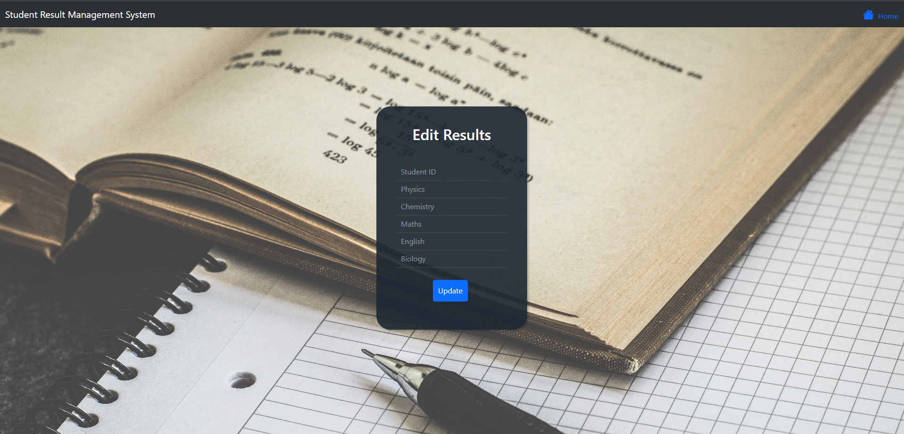

# Edunalytics: Smart Student Result Management

The Smart Student Result Management System is a web-based application designed to efficiently manage and display student results and academic information. It provides an easy-to-use interface for administrators to input, update, and view student records, as well as for students to access their own results.

## Features

- Admin Panel:
  - Login, password reset and authentication for administrators
  - Add, update, and view student records
  - Input and manage student grades and results

- Student Portal:
  - Login for students to access their own results
  - View individual subject grades and overall performance\
  
## Installation

1. Clone the repository:
   
   ```git clone https://github.com/Rituraj-commits/Edunalytics.git```
2. Navigate to the project directory:
   
   ```cd Edunalytics```
3. Install the required dependencies:
   
   ```npm install```

4. Start the development server:
   
   ```node app.js```

5. Access the application in your web browser at 
   
   `http://localhost:3000`

## Technologies Used

- ### Front-end
- HTML
- CSS
- Javascript
  

- ### Back-end
- Node.js
- Express.js
- MongoDB
  

- ### Authentication:
- bcrypt.js

## Product Screenshot

- ### Homepage
   

- ### Admin Login
   

- ### Admin Dashboard
   

- ### Student Results
  

- ### New Student
  

- ### Update Result
  

- ### Student Login
  

- ### Student Result
  